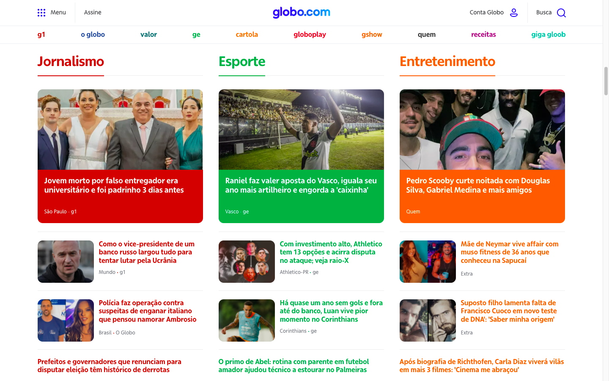

## Atividade final

Construir uma página web com layout similar ao da [globo.com](https://globo.com), conforme o exemplo/imagem abaixo. 

O site deve ser responsivo e atender as boas práticas do Lighthouse.

### Recursos open-source gratuitos
- Paleta de cores: [Duo](https://duo.alexpate.uk/), [Happy Hues](https://www.happyhues.co/)
- Ícones: [Iconduck](https://iconduck.com/)
- Ilustrações: [unDraw](https://undraw.co/)
- Análise de qualidade: [Lighthouse](https://developers.google.com/web/tools/lighthouse/)

> Importante: O site construído deve obter acima de 90 em todos os itens do Lighthouse.

